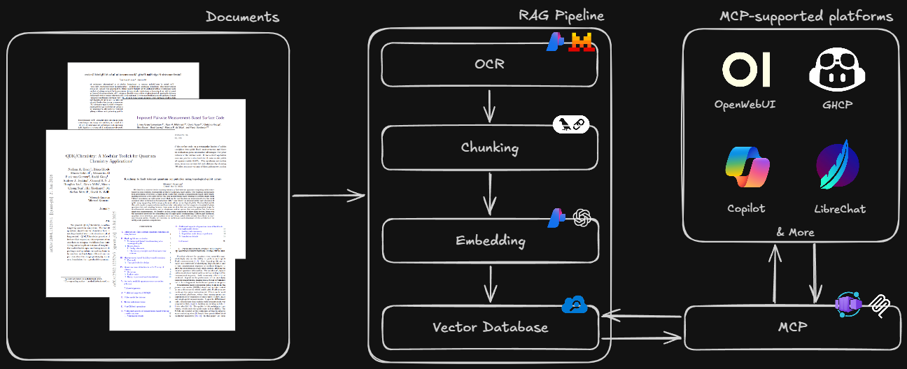

# AI for Research

Use internal knowledge sources with AI agents using MCP with Azure AI Search.

## Demo

Same MCP server, 2 different platforms, both of which do not support Azure AI Search natively.

### OpenWebUI

https://github.com/user-attachments/assets/e82f75ef-8999-4742-8b41-032626b0222e

### Github Copilot

https://github.com/user-attachments/assets/fc6121c8-bc79-4afb-b8e5-77549ed4a912

## Architecture



## Pre-requisites

- Python (Ideally Python 3.11 or 3.10 for best compatibility)
- uv (https://docs.astral.sh/uv/getting-started/installation/)
- MCP Python SDK (https://github.com/modelcontextprotocol/python-sdk?tab=readme-ov-file#installation)
- Basic understanding of Azure and AI foundry is beneficial but not required.

## Pipeline

### Setup

1. Copy [`.env.example`](./.env.example) and paste it in the same directory.
2. Rename the **copied** `.env.example` to `.env`
3. Open [Azure Portal](https://portal.azure.com)
4. Create Azure RG called `ai_for_research`

### Azure AI Search

1. Create AI Search resource on Azure portal called `ai-for-research-search`. (IMPORTANT: USE FREE PRICING TIER, recommended region: `swedencentral`)
2. In AI Search, go to `Search Management` > `Indexes`
3. Click on `Add Index` > `Add Index (JSON)`, this will open a sidebar where you can enter JSON config.
4. Copy JSON config from [`index_conf.json`](./index_conf.json) and paste it in the sidebar.
5. Click on `Save`
6. On left pane, click on `Overview`
7. Copy the `Url` in `Essentials`
8. Paste that `Url` in `.env` in the field `AZURE_SEARCH_ENDPOINT`
9. On left pane, go to `Settings` > `Keys`
10. Make sure `API Keys` is selected in API Access Control
11. Copy the API key under `Manage query keys`.
12. Paste that API key in the `.env` in the field `AZURE_SEARCH_API_KEY`
13. In the `.env`, set the field `AZURE_SEARCH_INDEX_NAME` to your index name. If you didn't change it, use `vector-index`.
14. Under `Manage admin keys`, copy the `Primary admin key`.
15. Paste the primary admin key in the `.env` in field `AZURE_SEARCH_PRIMARY_API_KEY`
16. The vector index is set up!

### Azure AI Foundry

1. Go to [Azure AI Foundry](https://ai.azure.com)
2. Toggle `New Foundry`
3. Create a project called `ai-for-research-foundry` under resource group `ai_for_research`, ideally in `swedencentral`
4. Copy the `Project API Key`
5. Paste that project api key in your `.env` in field `AZURE_OPENAI_API_KEY`

#### For OCR (Mistral Document OCR)

1. In top nav click on `Discover`
2. In left pane, click on `Models`
3. Search `mistral-document-ai-2505`
4. Click on first result called `mistral-document-ai-2505`
5. Click on `Deploy` > `Default Settings`
6. In your `.env` set `AZURE_MISTRAL_ENDPOINT` as `https://ai-for-research-foundry-resource.services.ai.azure.com/providers/mistral/azure/ocr`
7. Done!

#### For Embedding (OpenAI Text Embedding 3 Large)

1. In top nav click on `Discover`
2. In left pane, click on `Models`
3. Search `text-embedding-3-large`
4. Click on the first result called `text-embedding-3-large`
5. Click on `Deploy` > `Default Settings`
6. In your `.env` set `AZURE_OPENAI_ENDPOINT` as `https://ai-for-research-foundry-resource.cognitiveservices.azure.com`
7. Done!

#### For Inference (Mistral 3 Large)

1. In top nav click on `Discover`
2. In the left pane, click on `Models`
3. Search `Mistral-Large-3`
4. Click on the first result called `Mistral-Large-3`
5. Click on `Deploy` > `Default Settings`
6. In your `.env` set `AZURE_OPENAI_INFERENCE` as `https://ai-for-research-foundry-resource.services.ai.azure.com/openai/v1/`
7. Done!

### Running the Pipeline

1. Install dependencies: `pip install -r requirements.txt`

**Option A: Notebook** — Open `pipeline.ipynb`, select your Python kernel, and run cells sequentially.

**Option B: CLI ([`src/`](./src/))** — Scriptable Python modules for production use.

```bash
python -m src.main ingest            # OCR → chunk → embed → upload
python -m src.main query "question"  # retrieve + answer
```

> For full CLI docs, module breakdown, and env var reference, see [`src/README.md`](./src/README.md).

## MCP

For setup & docs go to [`./azure-ai-search-mcp/README.md`](./azure-ai-search-mcp/README.md)

## Cloud Deployment (Azure Container Apps)

See the full guide: [`azure-ai-search-mcp/azure/README.md`](./azure-ai-search-mcp/azure/README.md).

## Test Prompts

Sample queries ranked from easiest to hardest for retrieval:

| #   | Difficulty | Prompt                                                                                                                                                                                                                                               |
| --- | ---------- | ---------------------------------------------------------------------------------------------------------------------------------------------------------------------------------------------------------------------------------------------------- |
| 1   | Easy       | What modular software toolkit is introduced to connect classical electronic structure calculations to quantum circuit execution?                                                                                                                     |
| 2   | Medium     | In the newly proposed pairwise measurement-based surface code, what is the exact fault-tolerance threshold achieved under a standard circuit noise model?                                                                                            |
| 3   | Hard       | For the single-qubit tetron device, how do the "detuning-based" and "cutter-based" approaches differ in decoupling quantum dots from the qubit island, and how does each approach specifically affect residual coupling and overall qubit coherence? |
| 4   | Hard (Dev) | How does the QDK/Chemistry toolkit use a factory-based interface to let me swap out algorithm backends, like switching to PySCF, without rewriting my main Python workflow?                                                                          |

## Troubleshooting

- For Windows ARM64 systems, it will not work due to wheels not being available if you have `Python for ARM`, consider using `Python for x64`. Your system will automatically apply a virtual layer to ensure that Python x64 works on ARM.

## Credits

- [Aryan Shah (SE Intern)](https://github.com/aryxenv): RAG Pipeline + Azure Setup + Foundry Setup + MCP Server/Deployment + GHCP/OpenWebUI Integrations
- [Anass Gallass (SSP Intern)](https://github.com/anassgallass): Testing AI Search & GHCP MCP
- [Bertille Mathieu (SE Intern)](https://github.com/bertillessec): Testing AI Search & OpenWebUI MCP
