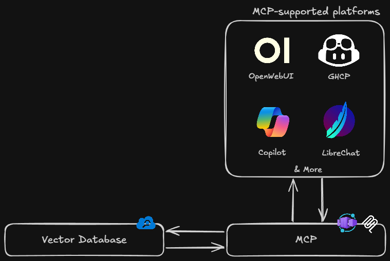

# Azure AI Search MCP Server

A Python-based Model Context Protocol (MCP) server that integrates Azure AI Search capabilities into agentic workflows.

## Features

- 🔍 **Semantic Search**: Context-aware AI search.
- 🔀 **Hybrid Search**: Combines full-text and vector search.
- 📝 **Text Search**: Keyword-based search.
- 🔎 **Filtered Search**: Search narrows results with OData filters.
- 📄 **Document Fetch**: Retrieve documents by ID.
- 📊 **Index Schema Resource**: Access index field metadata.
- 🌐 **OpenWebUI Integration**: Works with OpenWebUI via mcpo.

## Architecture



## Quickstart

### 1. Install Dependencies

```bash
git clone https://github.com/aryxenv/ai-for-research.git
cd azure-ai-search-mcp
uv venv
uv sync
```

### 2. Configure Environment

Create a `.env` file in the workspace root:

```env
AZURE_SEARCH_ENDPOINT=https://your-search-service.search.windows.net
AZURE_SEARCH_API_KEY=your-api-key-here
AZURE_SEARCH_INDEX_NAME=your-index-name
```

### 3. Run the Server

Use the provided scripts to start the server:

- **Dev Mode (MCP Inspector)**: `.\scripts\dev.ps1` (Windows) or `./scripts/dev.sh` (macOS/Linux)
- **Prod Mode (Streamable HTTP)**: `.\scripts\prod.ps1` (Windows) or `./scripts/prod.sh` (macOS/Linux)

## GitHub Copilot Integration

To use with GitHub Copilot (VS Code), add this to your VS Code `.vscode/mcp.json`:

```jsonc
{
  "servers": {
    "azure-ai-search": {
      "type": "http",
      "url": "https://mcp-search-app.politesky-cce0791d.swedencentral.azurecontainerapps.io/mcp", // demo server, replace with your own
      "headers": { "Content-Type": "application/json" },
    },
  },
}
```

The AI agent will auto-discover tools like `semantic_search`, `hybrid_search`, etc.

> [!NOTE]
> The example mcp server only contains `hybrid_search` tool to avoid hallucinations, enable other tools if needed in your mcp server.

## OpenWebUI Integration

OpenWebUI doesn't support the MCP protocol natively (yet, experimental only). We use [`mcpo`](https://pypi.org/project/mcpo/) to bridge the cloud-hosted MCP server to an OpenAPI endpoint that OpenWebUI can consume.

### Configure your MCP server URL

Open `mcpo-config.json` and replace the `url` with your own deployed MCP server endpoint:

```jsonc
{
  "mcpServers": {
    "azure-ai-search": {
      "type": "streamable-http",
      "url": "https://mcp-search-app.politesky-cce0791d.swedencentral.azurecontainerapps.io/mcp", // example server, replace with your url
    },
  },
}
```

> [!NOTE]
> The default URL is a demo server. After deploying your own MCP server
> (see [Cloud Deployment](#cloud-deployment-azure-container-apps) or the
> [Azure deployment guide](./azure/README.md)), update this URL with the endpoint
> from your deployment output.

### Prerequisites

```bash
pip install mcpo
```

### Run the mcpo proxy

The scripts start mcpo, which connects to the MCP server URL configured in
`mcpo-config.json` and exposes an OpenAPI endpoint locally for OpenWebUI.

From the `azure-ai-search-mcp` directory:

**Windows (PowerShell):**

```powershell
.\scripts\openwebui_mcp.ps1                             # mcpo on port 8001
.\scripts\openwebui_mcp.ps1 -McpoPort 9000              # custom port
.\scripts\openwebui_mcp.ps1 -ApiKey "my-secret"         # custom api key
```

**macOS / Linux:**

```bash
chmod +x scripts/openwebui_mcp.sh
./scripts/openwebui_mcp.sh                     # mcpo on port 8001
./scripts/openwebui_mcp.sh 9000                # custom port
./scripts/openwebui_mcp.sh 9000 my-key         # custom port + api key
```

> [!NOTE]
> You can also run mcpo directly: `mcpo --port 8001 --config mcpo-config.json --api-key "top-secret"`

### Add to OpenWebUI

1. Open OpenWebUI (default: `http://localhost:8080`)
2. Click on your profile (bottom left) → **Admin Panel**
3. In top nav bar, click on **Settings** → **External Tools**
4. Click the plus icon next to **Manage Tool Servers**
5. Enter:
   - **URL**: `http://localhost:8001/azure-ai-search`
   - **API Key**: `top-secret` (or whatever you set when launching the script)
6. Click **Save**

The MCP tools will now be available in your OpenWebUI chats (you may need to enable them manually before submitting a prompt).

> [!NOTE]
> The mcpo proxy and the GitHub Copilot config both connect to the same
> cloud-hosted MCP server, they can run simultaneously without conflict.

## Troubleshooting

### "Missing required environment variables"

Ensure all three environment variables are set:

- `AZURE_SEARCH_ENDPOINT`
- `AZURE_SEARCH_API_KEY`
- `AZURE_SEARCH_INDEX_NAME`

### Semantic search configuration

Semantic search works with or without explicit semantic configuration:

- **With semantic configuration**: Uses Azure's semantic ranker for best results
- **Without semantic configuration**: Falls back to vector search if vectorizer is configured, otherwise uses standard search
- You don't need semantic configuration if you have a vectorizer configured in your index

### "Document with ID 'xxx' not found"

The document ID doesn't exist in your index. Use a search tool first to find valid document IDs.

## Development

### Project Structure

```
azure-ai-search-mcp/
├── main.py                    # MCP server entry point
├── pyproject.toml             # Project dependencies
├── .python-version            # Python version specification
├── azure_search_client.py      # Azure Search client utilities
├── mcpo-config.json            # mcpo config for OpenWebUI integration
├── scripts/
│   ├── dev.ps1                # Dev mode launcher (Windows)
│   ├── dev.sh                 # Dev mode launcher (macOS/Linux)
│   ├── openwebui_mcp.ps1      # OpenWebUI mcpo launcher (Windows)
│   ├── openwebui_mcp.sh       # OpenWebUI mcpo launcher (macOS/Linux)
│   ├── prod.ps1               # Prod mode launcher (Windows)
│   └── prod.sh                # Prod mode launcher (macOS/Linux)
├── azure/
│   ├── Dockerfile              # Multi-stage Docker build
│   ├── .dockerignore           # Build-context exclusions
│   ├── infra.bicep             # Phase 1: ACR + Log Analytics + Environment
│   ├── app.bicep               # Phase 2: Container App
│   ├── deploy.ps1              # One-command deployment script
│   └── README.md               # Deployment guide
├── tools/
│   ├── __init__.py
│   ├── semantic_search.py      # Semantic search tool
│   ├── hybrid_search.py        # Hybrid search tool
│   ├── text_search.py          # Text search tool
│   ├── filtered_search.py      # Filtered search tool
│   └── fetch_document.py       # Document fetch tool
└── README.md                  # This file
```

## Related Resources

- [Azure AI Search Documentation](https://docs.microsoft.com/azure/search/)
- [Model Context Protocol](https://modelcontextprotocol.io/)
- [Azure SDK for Python](https://docs.microsoft.com/python/azure/)

## Credits

- [Aryan Shah (SE Intern)](https://github.com/aryxenv): MCP Server Setup + Github Copilot MCP setup & integration + OpenWebUI MCP setup & integration + MCP Deployment + Documentation
- [Anass Gallass (SSP Intern)](https://github.com/anassgallass): Testing AI Search & GHCP MCP
- [Bertille Mathieu (SE Intern)](https://github.com/bertillessec): Testing AI Search & OpenWebUI MCP
