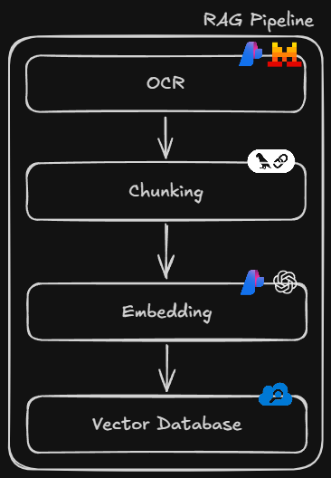

# `src/` — RAG Pipeline (CLI)

Scriptable version of [`pipeline.ipynb`](../pipeline.ipynb) for production use. Same pipeline, proper Python modules.

## Quick Start

```bash
# From the repo root
pip install -r requirements.txt

# Run full ingestion (OCR → chunk → embed → upload)
python -m src.main ingest

# Query the indexed data
python -m src.main query "Your question here"

# Interactive query prompt
python -m src.main query
```

> Requires a `.env` file in the repo root — see the main [README](../README.md) for setup.

## Pipeline Steps



## Modules

| Module         | What it does                                                                                                                                             |
| -------------- | -------------------------------------------------------------------------------------------------------------------------------------------------------- |
| `ocr.py`       | Reads PDFs from `data/`, splits into batches of 5 pages, sends each batch to **Mistral Document AI** for OCR. Returns per-page markdown text.            |
| `chunking.py`  | Two-stage markdown-aware chunking: first by headers (`#`, `##`, `###`), then by size (3000 chars, 500 overlap). Preserves section hierarchy as metadata. |
| `embedding.py` | Generates vector embeddings for each chunk using **Azure OpenAI `text-embedding-3-large`** (3072 dimensions).                                            |
| `indexing.py`  | Formats chunks into Azure AI Search documents (id, content, contentVector, location) and uploads in batches of 1000.                                     |
| `query.py`     | Hybrid search (keyword + vector) against the index, then generates an answer with **Mistral Large 3** using retrieved context.                           |
| `main.py`      | CLI entrypoint that orchestrates the modules. Two commands: `ingest` and `query`.                                                                        |

## Environment Variables

| Variable                       | Used by               | Purpose                                     |
| ------------------------------ | --------------------- | ------------------------------------------- |
| `AZURE_OPENAI_API_KEY`         | ocr, embedding, query | Azure AI Foundry project API key            |
| `AZURE_MISTRAL_ENDPOINT`       | ocr                   | Mistral Document AI OCR endpoint            |
| `AZURE_OPENAI_ENDPOINT`        | embedding, query      | Azure OpenAI embedding endpoint             |
| `AZURE_OPENAI_INFERENCE`       | query                 | Mistral Large 3 inference endpoint          |
| `AZURE_SEARCH_ENDPOINT`        | indexing, query       | Azure AI Search service URL                 |
| `AZURE_SEARCH_INDEX_NAME`      | indexing, query       | Search index name (default: `vector-index`) |
| `AZURE_SEARCH_PRIMARY_API_KEY` | indexing              | Admin key for uploading documents           |
| `AZURE_SEARCH_API_KEY`         | query                 | Query key for search requests               |

## Custom Data Directory

```bash
python -m src.main ingest path/to/pdfs
```
